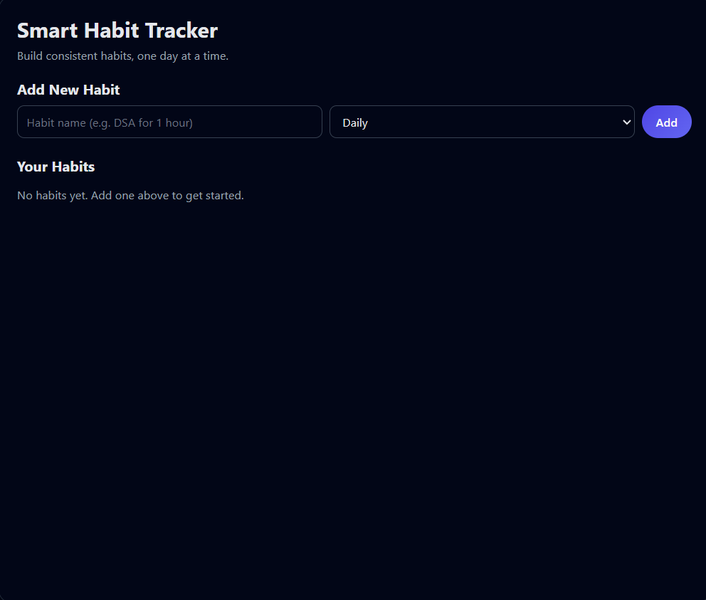
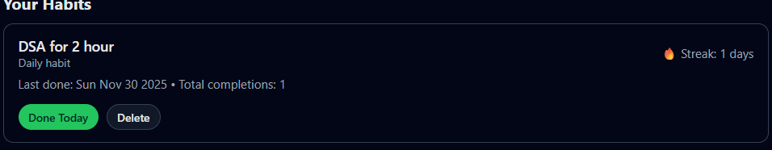

# 🧠 Smart Habit Tracker — Your Personal Productivity Dashboard

A clean, fast, and simple habit tracking web app that helps you build consistency with:

Daily/Weekly habits

Streak tracking

Total completions

Today-done check

Local persistence (no backend needed)

Built using HTML, CSS, JavaScript, and localStorage.


# 🚀 Features
✔ Add Habits

Create daily or weekly habits like:

DSA practice

Gym

Reading

Meditation

✔ Mark as “Done Today”

Each habit has a Done Today button with:

Streak increment

Total completions update

Prevents double-marking the same day

✔ Dynamic UI Rendering

All habits automatically build into clean cards with:

Habit name

Frequency

Current streak

Total completions

Last completed date

Delete button

✔ Persistent Storage

All habits are saved in:

localStorage


so they survive:

Browser refresh

Tab close

System restart

✔ Delete Habit

Remove habits anytime with a simple delete button.


# 📸 Screenshots
📁 images/
    ├── home.png
    └── completed.png

| Home Screen | Completed Habit |
|------------|-----------------|
|  |  |

	


# 🛠️ Tech Stack

HTML5

CSS3

JavaScript (ES6)

localStorage API

No backend required.


# 📁 Project Structure
```
smart-habit-tracker/
│
├── index.html
├── style.css
├── script.js
└── images/
     ├── home.png
     └── completed.png
```

# 📦 Installation & Usage

Download or clone this repository:

git clone https://github.com/anuranjansb/smart-habit-tracker.git


Open the index.html file in any browser.

Start adding habits and marking progress!


# 🔮 Future Enhancements

Dark / Light Mode

Weekly analytics dashboard

Calendar view

Graphs (Progress charts)

Reminder notifications

Firebase / MongoDB backend + authentication

Multi-device sync

Mobile responsive redesign


# 👤 Author

Anuranjan SB

🔗 GitHub: https://github.com/anuranjansb

🔗 LinkedIn: https://www.linkedin.com/in/anuranjan-sb-5b2500255/
